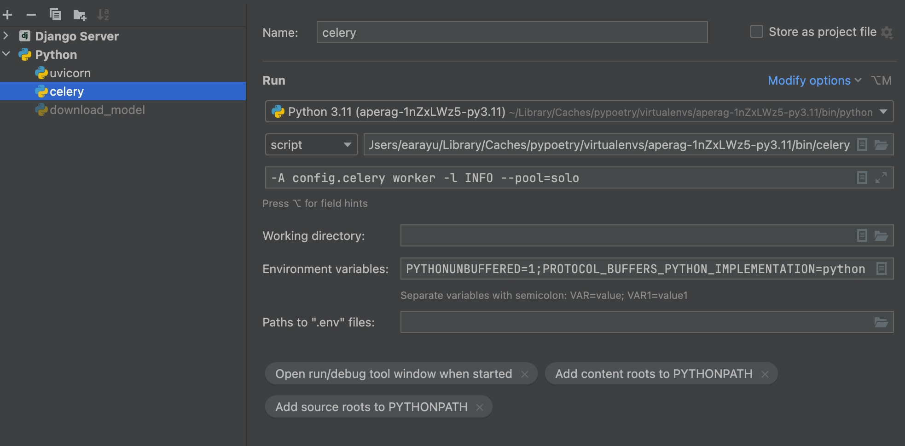
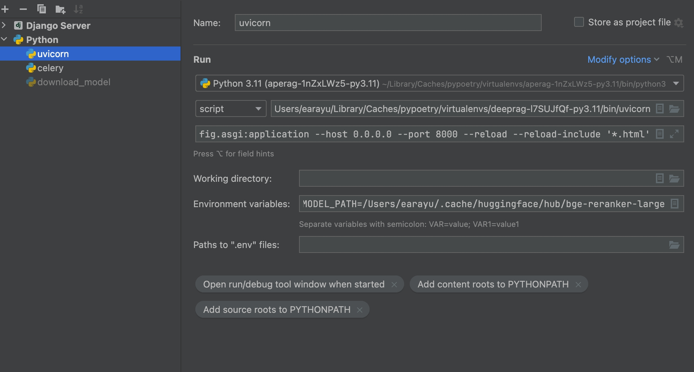

# ApeRAG Project PyCharm Debugging Guide

This document details how to debug two core components of the ApeRAG project in PyCharm: the Celery asynchronous task service and the web backend service.

---

## 1. Debugging Celery Tasks

### 1.1 Create Debug Configuration
1. Go to PyCharm's top menu: **Run > Edit Configurations**
2. Click **+** and select **Python**
3. Configure with the following parameters:

**Core Settings:**
```python
Name: celery
Python interpreter: [Poetry virtual environment path]
  # Get via: `poetry env info -p`, then append `/bin/python`
Script path: [Celery executable path]
  # Get via: `which celery` in terminal
Parameters: -A config.celery worker -l INFO --pool=solo
  # Critical parameter: --pool=solo (enables single-process mode for debugging)
Environment variables: 
  PYTHONUNBUFFERED=1;PROTOCOL_BUFFERS_PYTHON_IMPLEMENTATION=python
```



---

## 2. Debugging Web Backend

### 2.1 Create Debug Configuration
1. Go to **Run > Edit Configurations**
2. Click **+** and select **Python**
3. Configure with the following parameters:

**Core Settings:**
```python
Name: backend
Python interpreter: [Same Poetry virtual environment as Celery]
Script path: [uvicorn executable path]
  # Get via: `which uvicorn`
Parameters: config.asgi:application --host 0.0.0.0 --port 8000 --reload --reload-include '*.html'
Environment variables:
  PYTHONUNBUFFERED=1;
  DJANGO_SETTINGS_MODULE=config.settings;
```



